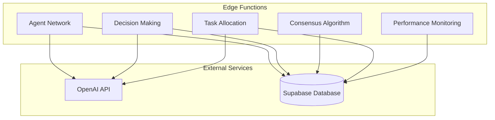
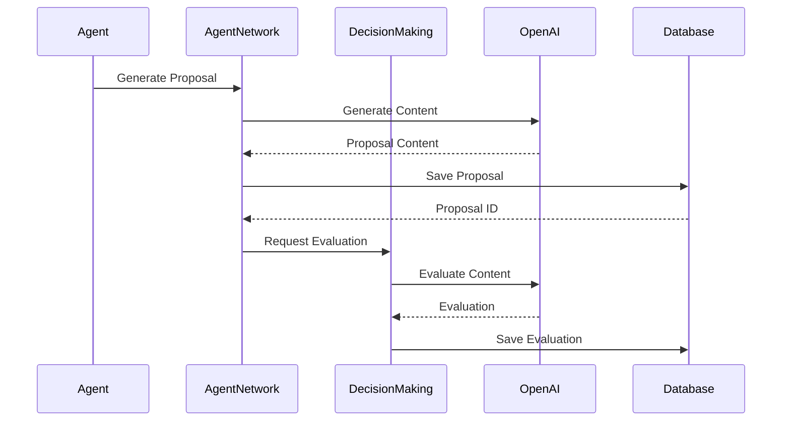
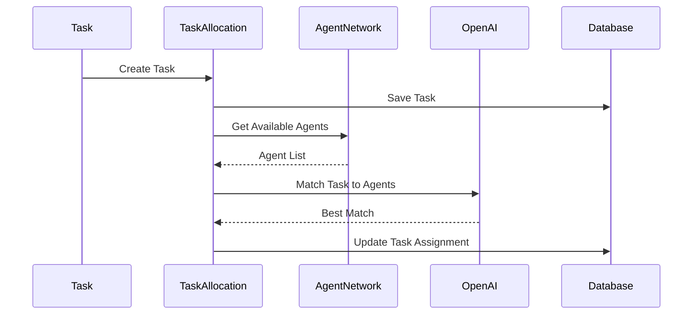
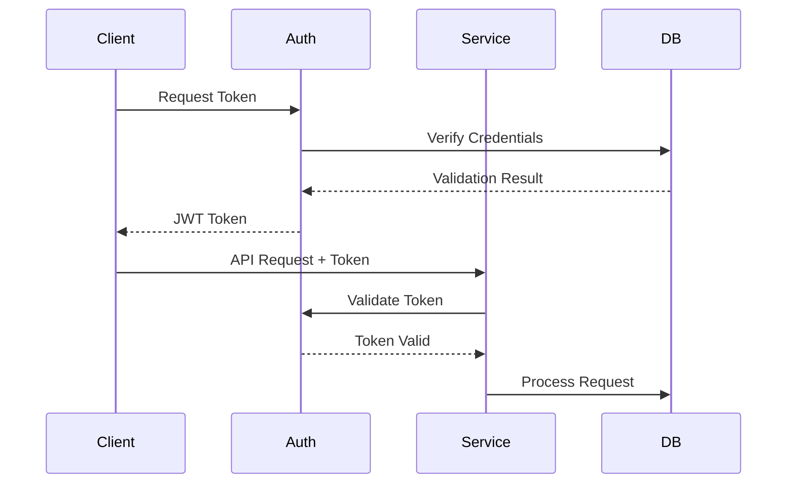
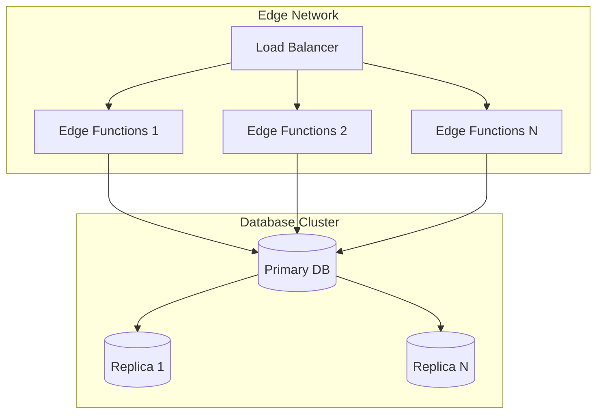
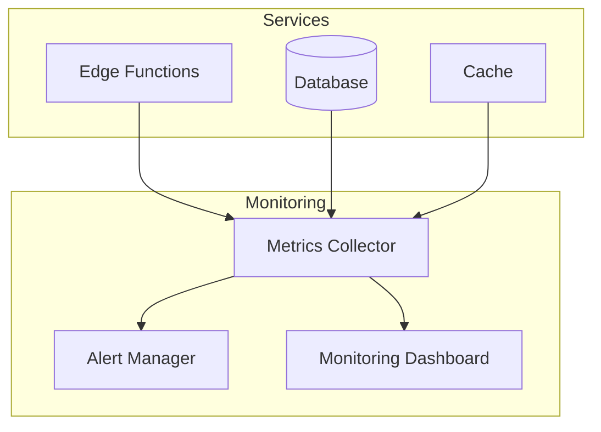
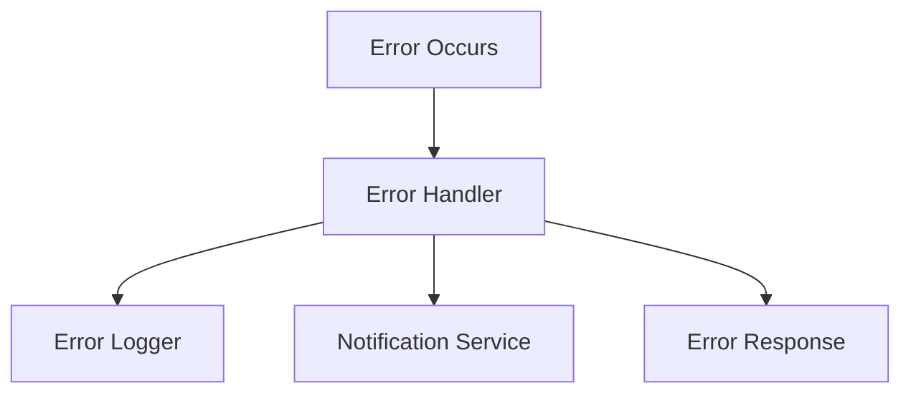

# AIDO Architecture

## System Overview

The AIDO system is built using a microservices architecture with Supabase Edge Functions, leveraging OpenAI for AI capabilities and Supabase for data persistence. The system is designed to be scalable, maintainable, and secure.

## High-Level Architecture

### Component Diagram


## Component Details

### 1. Agent Network Service

#### Responsibilities
- Agent registration and management
- Proposal generation
- Inter-agent communication
- Capability management

#### Key Classes
```typescript
class AgentNetwork {
    private repository: AgentRepository;
    private openai: OpenAIService;
    
    async registerAgent(details: AgentDetails): Promise<Agent>;
    async generateProposal(agentId: string, topic: string): Promise<Proposal>;
    async updateCapabilities(agentId: string, capabilities: string[]): Promise<Agent>;
    async getAgentProfile(agentId: string): Promise<AgentProfile>;
}

class AgentRepository {
    async save(agent: Agent): Promise<Agent>;
    async findById(id: string): Promise<Agent | null>;
    async update(id: string, updates: Partial<Agent>): Promise<Agent>;
    async list(filters?: AgentFilters): Promise<Agent[]>;
}

class OpenAIService {
    async generateResponse(prompt: string): Promise<string>;
    async analyzeCapabilities(description: string): Promise<string[]>;
}
```

### 2. Decision Making Service

#### Responsibilities
- Proposal evaluation
- Decision tracking
- Evaluation history
- Quality assurance

#### Key Classes
```typescript
class DecisionMaking {
    private repository: DecisionRepository;
    private openai: OpenAIService;
    
    async evaluateProposal(proposalId: string, evaluatorId: string): Promise<Evaluation>;
    async getEvaluationHistory(proposalId: string): Promise<Evaluation[]>;
    async updateEvaluation(evaluationId: string, updates: Partial<Evaluation>): Promise<Evaluation>;
}

class DecisionRepository {
    async saveEvaluation(evaluation: Evaluation): Promise<Evaluation>;
    async findEvaluations(proposalId: string): Promise<Evaluation[]>;
    async updateEvaluation(id: string, updates: Partial<Evaluation>): Promise<Evaluation>;
}
```

### 3. Consensus Service

#### Responsibilities
- Consensus calculation
- Vote weighting
- Decision finalization
- Conflict resolution

#### Key Classes
```typescript
class ConsensusService {
    private repository: ConsensusRepository;
    
    async calculateConsensus(proposalId: string): Promise<ConsensusResult>;
    async getVotingHistory(proposalId: string): Promise<Vote[]>;
    async finalizeDecision(proposalId: string): Promise<Decision>;
}

class ConsensusRepository {
    async saveVote(vote: Vote): Promise<Vote>;
    async findVotes(proposalId: string): Promise<Vote[]>;
    async updateDecision(proposalId: string, decision: Decision): Promise<void>;
}
```

### 4. Task Allocation Service

#### Responsibilities
- Task distribution
- Workload balancing
- Performance tracking
- Resource optimization

#### Key Classes
```typescript
class TaskAllocation {
    private repository: TaskRepository;
    private openai: OpenAIService;
    
    async allocateTask(task: Task): Promise<TaskAllocation>;
    async updateTaskStatus(taskId: string, status: TaskStatus): Promise<Task>;
    async getAgentWorkload(agentId: string): Promise<Workload>;
}

class TaskRepository {
    async saveTask(task: Task): Promise<Task>;
    async findTasks(filters: TaskFilters): Promise<Task[]>;
    async updateTask(id: string, updates: Partial<Task>): Promise<Task>;
}
```

### 5. Performance Monitoring Service

#### Responsibilities
- KPI tracking
- Metric collection
- Performance analysis
- System health monitoring

#### Key Classes
```typescript
class PerformanceMonitoring {
    private repository: MetricsRepository;
    
    async calculateKPIs(timeRange: TimeRange): Promise<KPIReport>;
    async trackMetric(metric: Metric): Promise<void>;
    async generateReport(timeRange: TimeRange): Promise<PerformanceReport>;
}

class MetricsRepository {
    async saveMetric(metric: Metric): Promise<void>;
    async findMetrics(filters: MetricFilters): Promise<Metric[]>;
    async aggregateMetrics(groupBy: string[]): Promise<AggregatedMetrics>;
}
```

## Data Flow

### 1. Proposal Generation and Evaluation


### 2. Task Allocation Flow


## Security Architecture

### Authentication Flow


### Authorization Layers
1. **API Gateway**
   - Token validation
   - Rate limiting
   - Request logging

2. **Service Layer**
   - Role-based access
   - Resource ownership
   - Action permissions

3. **Data Layer**
   - Row-level security
   - Data encryption
   - Audit logging

## Deployment Architecture

### Infrastructure


## Monitoring Architecture

### Metrics Collection


## Error Handling

### Error Flow


## Configuration Management

### Environment Configuration
```yaml
development:
  openai:
    api_key: ${OPENAI_API_KEY}
    model: gpt-4
  database:
    url: ${SUPABASE_URL}
    key: ${SUPABASE_KEY}
  monitoring:
    level: debug
    metrics: true

production:
  openai:
    api_key: ${OPENAI_API_KEY}
    model: gpt-4
  database:
    url: ${SUPABASE_URL}
    key: ${SUPABASE_KEY}
  monitoring:
    level: info
    metrics: true
